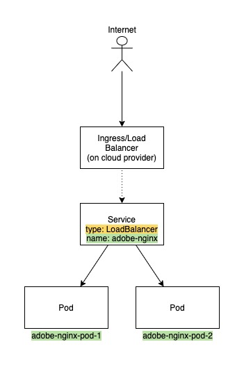

# Interview Challenges

## How to run coding challenge python script

**Pre-requisites**: Install Python3 version >= 3.9

Follow the below steps to setup and run the coding challenge python program

1. (Optional) Set 2 environment variables `GITHUB_USERNAME` and `GITHUB_TOKEN` for authenticating with Github API. If you dont set these 2 env variables, you are restricted to Github API Rate limits
    ```sh
    $ export GITHUB_USERNAME="foo"
    $ export GITHUB_TOKEN="bar"
    ```
2. Install these two python packages required `requests` and `prettytable` for this program to run using `pip3`
    ```sh
    $ pip3 install requests prettytable
    ```
3. Run the `coding_challenge.py` file from command line and you will see a table printed with repo names under `adobe` GitHub Org sorted based on last updated time, also has extra info like Stargazers, if repo has been archived and the Size(in KB) of the repo.
    ```sh
    $ python3 coding_challenge.py
    +--------------------------------------------+------------+----------------------+----------+-------------+
    |                 Repo Name                  | Stargazers |     Updated time     | Archived | Size(in KB) |
    +--------------------------------------------+------------+----------------------+----------+-------------+
    |                  brackets                  |   33700    | 2021-08-01T18:03:08Z |  False   |    92926    |
    |         helix-redirect-accelerator         |     0      | 2021-08-01T15:12:20Z |  False   |     4035    |
    |                helix-deploy                |     2      | 2021-08-01T15:09:09Z |  False   |     4703    |
    |                helix-embed                 |     4      | 2021-08-01T15:06:53Z |  False   |    15611    |
    |              helix-run-query               |     3      | 2021-08-01T15:05:54Z |  False   |    20346    |
    |                helix-purge                 |     1      | 2021-08-01T15:05:47Z |  False   |     6227    |
    |            helix-content-proxy             |     1      | 2021-08-01T14:54:26Z |  False   |    12503    |
    |               helix-logging                |     2      | 2021-08-01T14:54:12Z |  False   |     5558    |
    |                   .                        |     .      |         .            |    .     |      .      |
    |                   .                        |     .      |         .            |    .     |      .      |
    |                   .                        |     .      |         .            |    .     |      .      |
    +--------------------------------------------+------------+----------------------+----------+-------------+
    ```
    If there were any errors authenticating or hitting Github you will see the error message provided by the python program.
    ```sh
    $ python3 coding_challenge.py
    Failed to list repos, Error when hitting url: https://api.github.com/orgs/adobe/repos, status: 401, msg: Unauthorized

    $ python3 coding_challenge.py
    Failed to list repos, Error when hitting url: https://api.github.com/orgs/adobe/repos, status: 403, msg: Forbidden
    ```
## System Design for Hello Adobe nginx web app

### Assumptions

1. I'm deploying an nginx server which is exposed only on port 80 for http traffic.
2. I'm ignoring about https secure traffic by not minding about ssl certs in this System design.
3. Has a k8s cluster provisioned in a cloud provider env.
4. Has push and pull access to a docker registry in a cloud provider env.
5. Your cloud account where k8s cluster lives has required access and resources to create a LoadBalancer in cloud.

### Highlevel flow




### Steps to follow

1. Build your adobe nginx application exposed on port `80`
2. Push it to a docker registry
3. Deploy/create a k8s secret `imagePullSecret` for pulling image from a remote docker registry. Deploy your nginx image as a k8s `Deployment` with replicas set to `1` or `2` and expose on port `80`
4. Deploy a k8s service kind Ingress/LoadBalancer
5. Get your external IP or address and port(s) from kubectl describing your ingress/service.
6. Perform a curl or open a browser and enter IP/address:port from step5 and you will see a html page "Hello, Adobe!"


### Keeping Security in mind

Following are some of the situations where one should harden security access to your container running nginx server.

1. Expose only necessary ports on the image used.
This can be achieved by setting only `EXPOSE 80` in Dockerfile when building the container.

2. Similarly only expose necessary ports at container runtime in pod by defining in deployment spec.
This can be achieved by setting `containerPort: 80` in path `.spec.template.spec.containers.ports`

3. Run the container as non-root so that the container filesystem is not exploited when attacked.
This can be set at image build time by defaulting to `non-root` user and also run the container as non-root at deploy time.
Set 

4. Set resource limits on the nginx app container so that if an attacker somehow escapes pod and increases replica count to hundreds or thousands. This can exhaust your cluster or burden k8s API server and may end up crashing your k8s cluster.
Remediate this by setting `CPU` and `memory` quota `requests` and `limits` in deployment yaml for each container you specify in spec.

5. Maintain and isolate your app in specific namespace. Do not run your app in core namespaces like `kube-system` etc where higher privileges are available
Remediate this by setting `metadata.namespace` field in your deployment.

6. Maintain and isolate your app to a specific ServiceAccount, do not run your app without a serviceAccount specified, otherwise it defaults to serviceAccount `default`. This can have higher privileges than what is required for your app.
Remediate this by setting `spec.serviceAccountName` field in your deployment

7. Give only necessary RBAC permissions to the serviceAccount your app is tied into, or else if an attacker gains access to a token to authenticate to your k8s api server, they can exploit other k8s resources or secrets etc...
Based on the needs of your application, set only the minimum level of rules in your `Role` which is tied to your `ServiceAccount` via `RoleBinding`

8. For k8s Service, expose only required `targetPort`(s) which you need to tie into your nginx pods.

9. Set some rules for network traffic flow into pods by setting `NetworkPolicy`. For this to work, install `Calico` or other tools in your cluster. For example I'm assuming `Calico` is installed on this cluster, and now set a `NetworkPolicy` which accepts all ingress only on port 80 for pod selector labels `run: adobe-nginx` which map to the adbe nginx pods.

10. Secure your k8s cluster etcd database by placing it behind a firewall or encrypting data in etcd.

11. Create a  `PodSecurityPolicy` or set `securityContext` of pods template in your deployment to `privileged: false`, `allowPrivilegeEscalation: false` and `readOnly: true` so that attacker doesn't corrupt or destroy data in your container or host(k8s nodes) filesystem.

### Code Snippets

1. Code snippet for nginx app Dockerfile
    ```Dockerfile
    FROM nginx:alpine

    RUN touch /var/run/nginx.pid && \
      chown -R nginx:nginx /var/run/nginx.pid && \
      chown -R nginx:nginx /var/cache/nginx /etc/nginx/

    EXPOSE 80

    USER nginx

    COPY content.html /usr/share/nginx/html/index.html

    ```
2. Code snippet for k8s deployment yaml
    ```yaml
    apiVersion: apps/v1
    kind: Deployment
    metadata:
      name: adobe-nginx
      namespace: adobe
    spec:
      serviceAccountName: adobe
      selector:
        matchLabels:
          run: adobe-nginx
      replicas: 2
      template:
        metadata:
          labels:
            run: adobe-nginx
        spec:
          imagePullSecrets:
          - name: myregistrykey
          containers:
          - name: adobe-nginx-app
            image: "<registry>/<namespace>/adobe-nginx:latest"
            ports:
            - containerPort: 80
            # set resource limits
            resources:
              requests:
                memory: "64Mi"
                cpu: "250m"
              limits:
                memory: "128Mi"
                cpu: "500m"
    ```
3. Code snippet for k8s Network Policy
    ```yaml
    apiVersion: networking.k8s.io/v1
    kind: NetworkPolicy
    metadata:
      name: access-adobe-nginx
      namespace: adobe
    spec:
      podSelector:
        matchLabels:
          run: adobe-nginx
      ingress:
      - ports:
        - port: 80
          protocol: TCP
    ```
4. Code snippet for k8s service yaml
    ```yaml
    apiVersion: v1
    kind: Service
    metadata:
      name: adobe-nginx
      namespace: adobe
      labels:
        run: adobe-nginx
    spec:
      type: LoadBalancer
      ports:
      - port: 8080
        targetPort: 80
        protocol: TCP
      selector:
        run: adobe-nginx
    ```
5. Code snippet for k8s Ingress yaml
  ```yaml
  apiVersion: networking.k8s.io/v1beta1
  kind: Ingress
  metadata:
    name: adobe-nginx
    namespace: adobe
    annotations:
      kubernetes.io/ingress.class: alb
      alb.ingress.kubernetes.io/scheme: internet-facing
      alb.ingress.kubernetes.io/target-type: ip
  spec:
    rules:
    - http:
        paths:
        - backend:
            serviceName: adobe-nginx
            servicePort: 8080
  ```